# Attar

**An open-source perfume shop you can run for ৳0.** A deal-driven storefront
modelled on Jomashop, plus a full admin panel, built for shops that confirm
orders by phone and take Cash on Delivery, bKash or Nagad instead of card
payments.

Built for Bangladesh first, configurable for any market: currency, delivery
zones and payment methods all live in one config file.

[](https://github.com/nadidazwad/nextjs-perfume-store/actions/workflows/ci.yml)
[](LICENSE)

**[Live demo →](https://nextjs-perfume-store.vercel.app)** (fictional store: browse, filter, and
place a test order). Hands-on admin access for visitors is coming next.

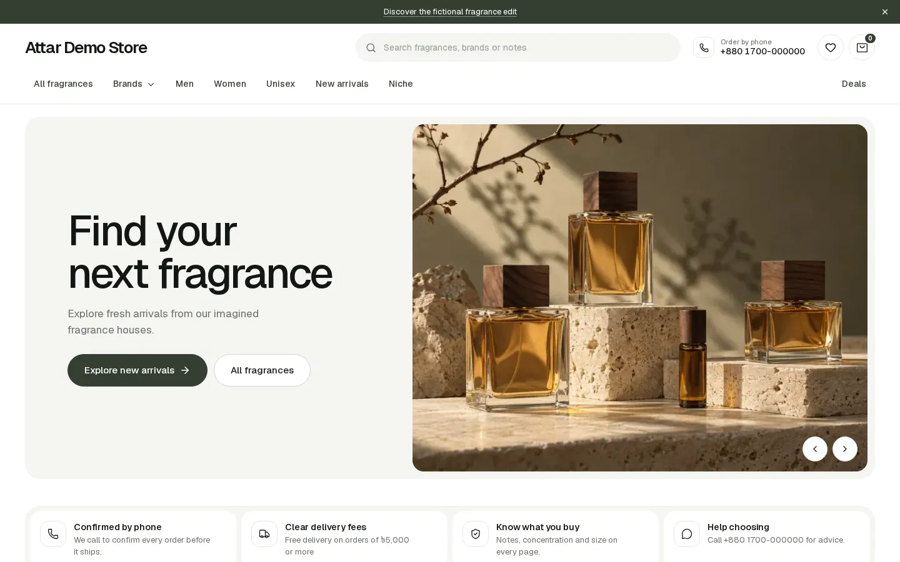

## What you get

**Storefront** (no customer accounts; customers are identified by phone number)
- Brand-first navigation, strikethrough prices and deal badges, and filters
  built for perfume: notes, concentration, gender, size, tester or gift set,
  brand type
- Product pages with a notes pyramid, size variants, gallery, related
  products, and (optional) verified-purchase reviews
- A checkout that asks only for name, phone and address, with COD or manual
  bKash/Nagad (the customer enters the TrxID)
- Order tracking by order number + phone, wishlist, recently viewed,
  coupons, search suggestions
- Mobile-first from 360 px, and fast: Lighthouse mobile 95 on home, listing
  and product pages

**Admin** (`/admin`)
- An order queue built around the confirmation call: status timeline, call
  log, notes, payment verification, courier and tracking details
- Products with variants and stock, brands, notes, collections, homepage
  sections, banners, static pages, customers (with a block switch for fake
  orders), coupons, review moderation
- New-order alerts on Telegram or email

## Screenshots

<table>
<tr>
<td width="50%">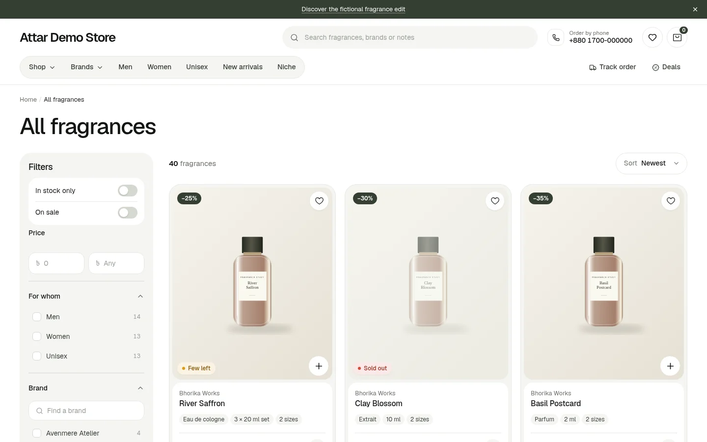<br><sub>Listing with perfume filters and live counts</sub></td>
<td width="50%">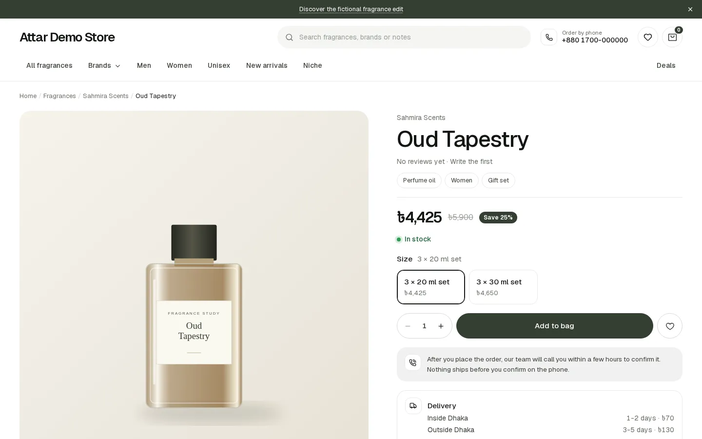<br><sub>Product page</sub></td>
</tr>
<tr>
<td>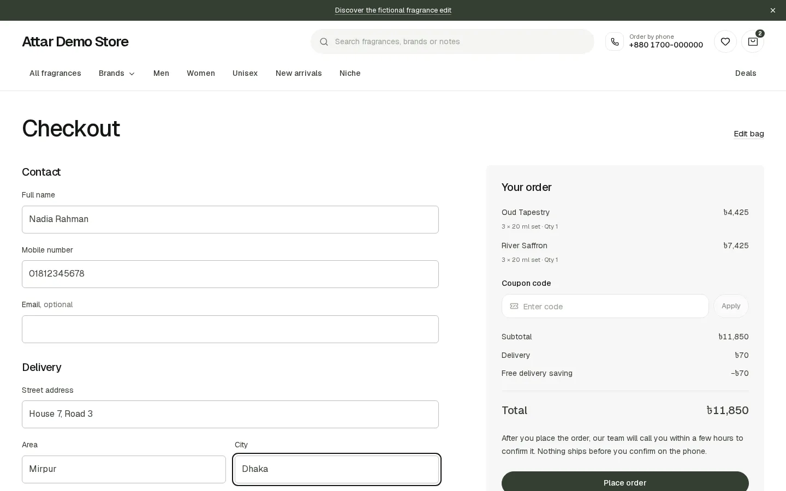<br><sub>Checkout: name, phone and address only</sub></td>
<td>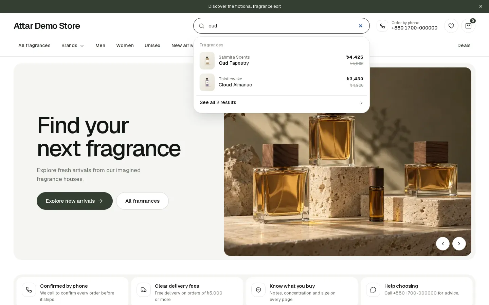<br><sub>Search suggestions</sub></td>
</tr>
<tr>
<td>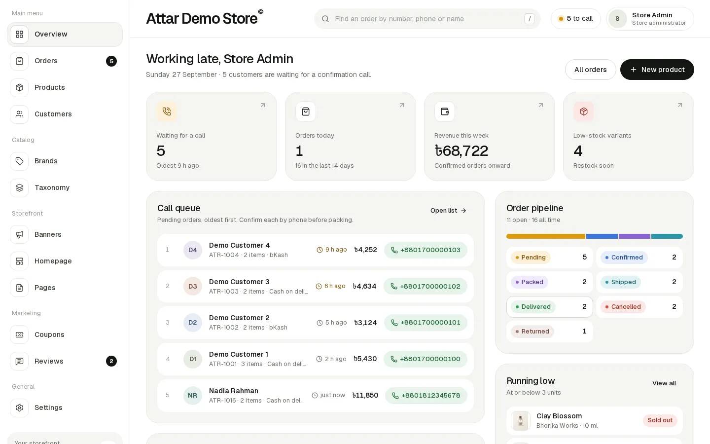<br><sub>Admin overview: the call queue comes first</sub></td>
<td>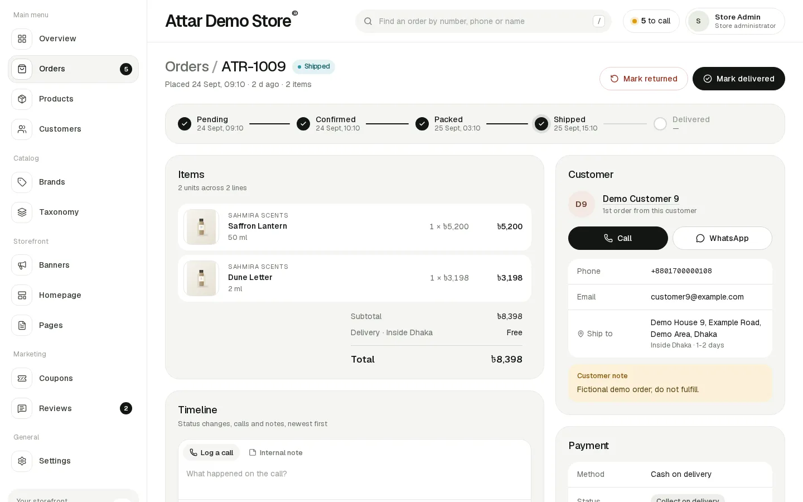<br><sub>Order detail: status, call log, payment</sub></td>
</tr>
<tr>
<td>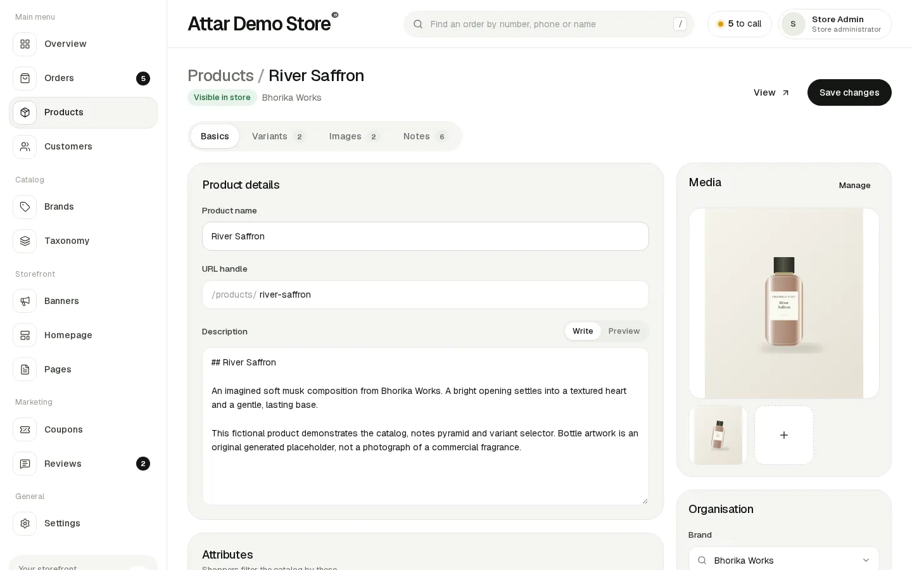<br><sub>Product editor</sub></td>
<td>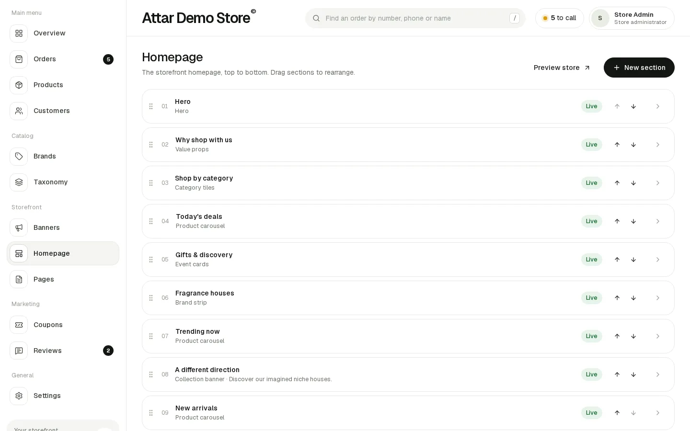<br><sub>Homepage sections, drag to reorder</sub></td>
</tr>
</table>

<table><tr>
<td>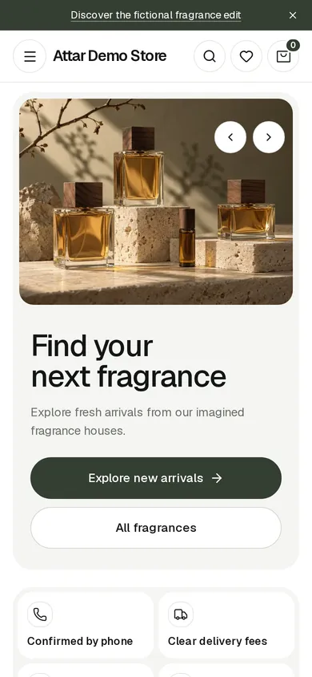</td>
<td>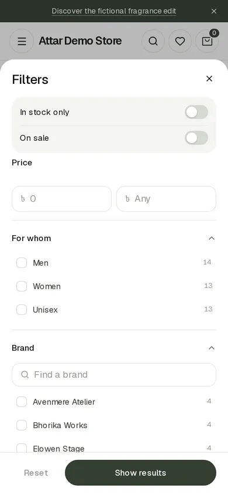</td>
<td>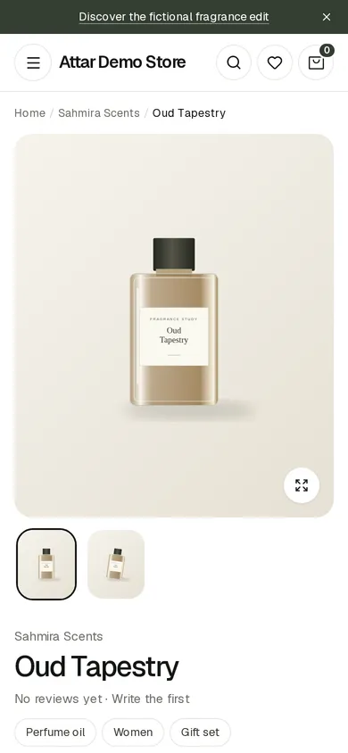</td>
<td>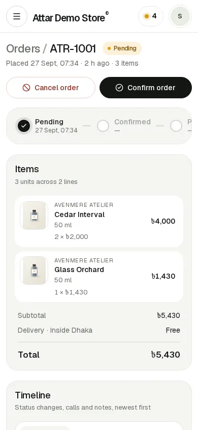</td>
</tr></table>

**[See all 34 screenshots →](docs/SCREENSHOTS.md)**

## Try it locally (no accounts needed)

You need [Node.js](https://nodejs.org) 22 or newer and pnpm (`corepack enable`
installs it).

```bash
git clone https://github.com/nadidazwad/nextjs-perfume-store.git my-store && cd my-store
pnpm install
pnpm db:migrate   # creates the built-in local database in .data/
pnpm db:seed      # demo catalog, orders and an admin account
pnpm dev
```

- Storefront: http://localhost:3000
- Admin: http://localhost:3000/admin with `admin@example.com` / `admin1234`

No `.env` file is needed. Locally, Attar uses an embedded Postgres (PGlite),
prints order alerts to the terminal, and saves uploaded images to disk.

## Make it yours

Everything store-specific lives in **[`store.config.ts`](store.config.ts)**:
name, phone and WhatsApp, currency, delivery zones and fees, the
free-delivery threshold, payment methods with your bKash/Nagad numbers,
theme colours and corner style, feature flags (wishlist, reviews, coupons,
recently viewed), and SEO defaults. The file documents every field, and an
invalid value stops `pnpm dev` and `pnpm build` with the exact field and
reason.

Your catalog, homepage, banners and pages are managed in the admin panel.

## Deploy

| Option | Cost | Good for | Guide |
|---|---|---|---|
| **Vercel + Neon** | ৳0 | trying it, demos, a store you're setting up | [docs/deploy/vercel-neon.md](docs/deploy/vercel-neon.md) |
| **Docker** on your own server or a free VM | ৳0 on a free VM | a live business | [docs/deploy/docker.md](docs/deploy/docker.md) |

> [!WARNING]
> Vercel's free Hobby plan is licensed for **non-commercial use only**. Use it
> to try Attar. For a store taking real orders, upgrade to Vercel Pro or
> self-host with Docker.

[](https://vercel.com/new/clone?repository-url=https%3A%2F%2Fgithub.com%2Fnadidazwad%2Fnextjs-perfume-store&env=DATABASE_URL,BETTER_AUTH_SECRET,NEXT_PUBLIC_APP_URL,ADMIN_EMAIL,ADMIN_PASSWORD&envDescription=Database%20URL%20from%20Neon%2C%20a%20random%20secret%2C%20your%20store%20URL%20and%20your%20admin%20login&envLink=https%3A%2F%2Fgithub.com%2Fnadidazwad%2Fnextjs-perfume-store%2Fblob%2Fmain%2Fdocs%2Fdeploy%2Fvercel-neon.md)

Optional services, all with free tiers:

| Service | What it's for | Guide |
|---|---|---|
| Telegram bot or Resend | new-order alerts for your team | [docs/deploy/notifications.md](docs/deploy/notifications.md) |
| Cloudflare R2 (or any S3-compatible bucket) | product image uploads on Vercel | [docs/deploy/storage.md](docs/deploy/storage.md) |

Every environment variable is documented in [`.env.example`](.env.example).

## FAQ

**Do I need a payment gateway?**
No. Customers choose Cash on Delivery, or send money by bKash/Nagad and enter
the transaction ID. Your team verifies it during the confirmation call and
marks it in the admin.

**Do customers need an account?**
No. They check out with name, phone and address, and track orders with the
order number and phone. Only your team signs in, at `/admin`.

**How do I get rid of the demo data?**
For a real store, start from an empty database and seed only your admin
account: `SEED_DEMO_DATA=false pnpm db:seed` (or `pnpm db:seed --admin-only`).
The deploy guides show where to set it. Demo brands, products and photos are
fictional.

**Can I sell outside Bangladesh?**
Currency, delivery zones, payment labels and all text are configurable. Phone
number validation is Bangladesh-specific today (`src/lib/phone.ts`), so other
markets need a small change there.

**I forgot the admin password.**
The seed never changes an existing account. Set a new `ADMIN_EMAIL` and
`ADMIN_PASSWORD`, then run `pnpm db:seed --admin-only` (on Vercel, update the
variables and redeploy). That creates a second admin account you can sign in
with.

**How are customers protected from spam and abuse?**
Checkout, order tracking, reviews and admin sign-in are rate limited. Blocked
customers can't check out. Prices and stock are re-checked on the server for
every order. Uploads are type- and size-checked. In production, order details
stay out of server logs.

**How do I update to a newer version?**
Pull the changes. Vercel production deploys run new migrations automatically.
With Docker, run `docker compose up -d --build`. Locally, run
`pnpm db:migrate`.

**Can AI coding agents work on this?**
Yes, that's a design goal. [`AGENTS.md`](AGENTS.md) gives agents the map,
invariants and recipes (add a filter, a homepage section, a notification
adapter, a feature flag).

## Tech

Next.js 16 (App Router) · TypeScript · Tailwind CSS v4 · shadcn/ui ·
Drizzle ORM · Postgres (PGlite locally) · Better Auth (admin only) · Zod

```bash
pnpm dev          # development server
pnpm build        # production build
pnpm lint         # ESLint
pnpm typecheck    # TypeScript
pnpm test         # unit and integration tests (run on an embedded database)
pnpm db:migrate   # apply migrations (local or DATABASE_URL)
pnpm db:seed      # idempotent seed; --admin-only for a clean store
```

## Documentation

| Doc | What's inside |
|---|---|
| [docs/SCREENSHOTS.md](docs/SCREENSHOTS.md) | Every storefront and admin screen, desktop and phone |
| [docs/SPEC.md](docs/SPEC.md) | The full functional spec: data model and every feature with acceptance criteria |
| [docs/DESIGN_SYSTEM.md](docs/DESIGN_SYSTEM.md) | Design tokens and UI rules for the storefront and admin |
| [docs/IMPLEMENTATION_PLAN.md](docs/IMPLEMENTATION_PLAN.md) | How it was built, phase by phase |
| [AGENTS.md](AGENTS.md) | Repo map, invariants and recipes for contributors and AI agents |
| [CONTRIBUTING.md](CONTRIBUTING.md) | How to set up, test and send a pull request |

## License

[MIT](LICENSE): free for personal and commercial use.
